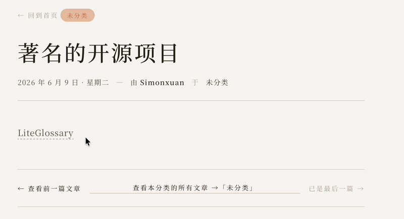
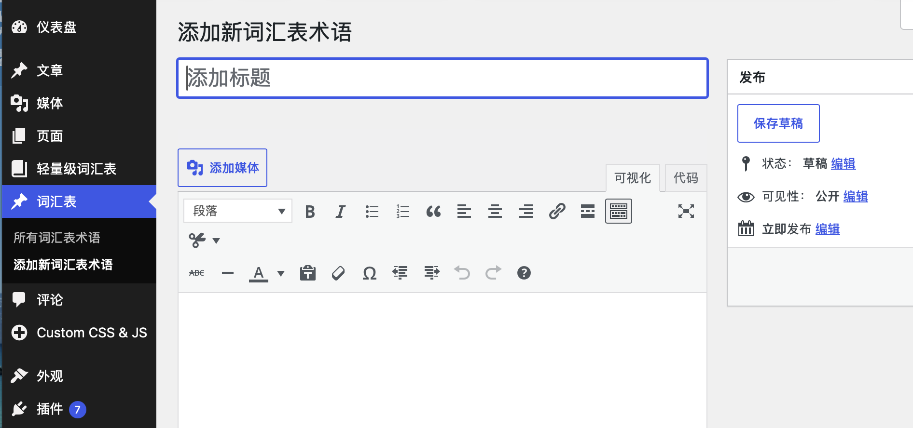
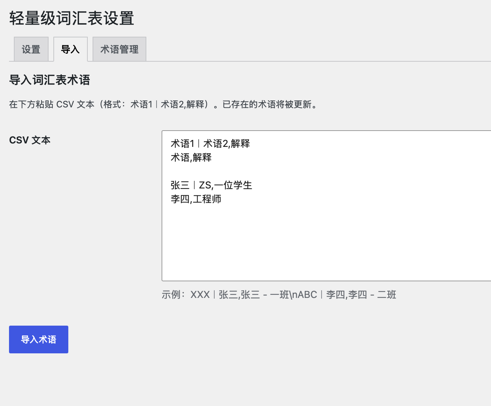
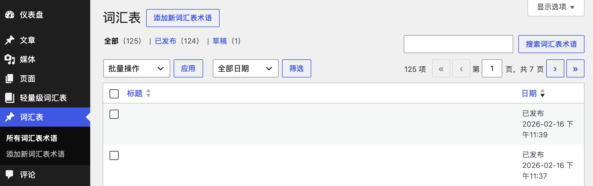

<div align="center">

# 📖 Lite-Glossary · 轻量级词汇表

**为 WordPress 文章自动添加术语工具提示的极简插件**

零依赖 · 原生中文 · 智能匹配 · 高性能缓存

**简体中文** · [English](README.en.md)

<br>

[](https://github.com/Simon-xuan/Lite-Glossary/releases)
[](https://wordpress.org/)
[](https://www.php.net/)
[](http://www.gnu.org/licenses/gpl-2.0.txt)
[](#-为什么选择-lite-glossary)

[功能特点](#-功能特点) ·
[安装](#-安装) ·
[使用指南](#-使用指南) ·
[常见问题](#-常见问题-faq) ·
[许可证](#-许可证)

</div>

---

> **Lite-Glossary** 是一款专为 WordPress 打造的极简术语工具提示插件。它用原生技术栈（纯 CSS + Vanilla JS）替代臃肿的同类插件，让你在文章中划过术语即可看到释义——快、轻、无依赖。

<div align="center">

<!-- 截图① 前端工具提示效果（划过术语弹出释义）-->


</div>

---

## ✨ 功能特点

| 功能 | 说明 |
| :--- | :--- |
| 🧩 **专用管理面板** | 通过自定义文章类型（CPT）集中管理所有专业术语 |
| 🎯 **智能匹配算法** | 自动识别正文术语，智能避开已有超链接 `<a>` 与标题 `<h1>`–`<h6>`，不破坏布局 |
| 🥇 **首词高亮模式** | 可全局设置仅高亮文内首次出现的术语，保持页面整洁 |
| ⚡ **极速原生前端** | 纯 CSS + 原生 JavaScript，零依赖（无 jQuery），不加载冗余库 |
| 📥 **批量便捷导入** | 支持 CSV 文本格式一键导入大量术语 |
| 🚀 **高性能架构** | 内置 Transient 缓存机制，大幅减少数据库查询 |
| 🀄 **原生中文支持** | 正则匹配与数据存储均针对中文优化，无乱码、无误匹配 |
| 🔗 **结构通用** | 采用与 CM Tooltip 类似的底层数据结构，理论上可能兼容（未经实测，请自行验证） |

---

## 🤔 为什么选择 Lite-Glossary

- **轻** — 整个插件仅几个 PHP 文件 + 一份 CSS/JS，安装即用。
- **快** — 前端无任何第三方库，术语数据走缓存，几乎零额外开销。
- **稳** — 基于 `DOMDocument` 解析正文，只处理纯文本节点，绝不污染链接与标题。
- **省心** — 中文原生支持，CSV 批量导入，后台一处管理。

---

## 🚀 安装

1. **下载**：从 [Releases](https://github.com/Simon-xuan/Lite-Glossary/releases) 页面获取最新的 `LiteGlossary.zip`。
2. **上传**：登录 WordPress 后台 → **插件** → **添加新插件** → **上传插件**，选择 `LiteGlossary.zip`。
3. **激活**：安装完成后点击 **激活插件**，左侧菜单即出现「轻量级词汇表」与「词汇表」。

---

## 📖 使用指南

### 1️⃣ 添加单个术语

进入后台 **词汇表 → 添加新术语**：

- **标题栏**：填写术语名称，支持别名，用全角竖线 `｜` 分隔。
- **正文栏**：填写该术语的释义（即工具提示内容）。

| 标题写法 | 匹配效果 |
| :--- | :--- |
| `Phone` | 文中出现 “Phone” 时弹出其释义 |
| `TV｜Television` | 匹配 “TV” 或 “Television” 时弹出同一释义 |

<div align="center">

<!-- 截图② 后台「添加新术语」编辑界面 -->


</div>

### 2️⃣ 批量导入术语

在 **轻量级词汇表 → 导入** 标签页粘贴 CSV 文本，每行一条，格式为 `术语[｜别名],释义`：

```text
ABC｜张三,张三 - 一班
DEF｜李四,李四 - 二班
Phone,手机
TV｜Television,电视
```

> 💡 已存在的同名术语会被**自动更新**而非重复创建。

<div align="center">

<!-- 截图③ 后台「导入」标签页 -->


</div>

### 3️⃣ 设置与管理

- **设置** 标签页：勾选「仅高亮内容中首次出现的术语」即可开启首词高亮模式。
- **术语管理** 标签页：查看、编辑、单条删除或批量删除所有术语。

<div align="center">

<!-- 截图④ 词汇表术语列表 / 管理 -->


</div>

---

## 🎨 自定义外观

工具提示的样式集中在 `assets/css/tooltip.css`，可直接修改气泡背景色、字号、圆角等：

```css
.lite-glossary-tooltip {
    background-color: #333;   /* 气泡背景色 */
    color: #fff;              /* 文字颜色 */
    border-radius: 4px;       /* 圆角 */
    font-size: 14px;          /* 字号 */
}
```

---

## ❓ 常见问题 (FAQ)

<details>
<summary><strong>支持中文术语吗？</strong></summary>

完美支持。插件在正则匹配（`/u` 修饰符）和数据库存储上均针对中文等多字节字符做了优化。
</details>

<details>
<summary><strong>如何自定义工具提示的外观？</strong></summary>

直接修改插件目录下的 `assets/css/tooltip.css` 即可，详见 [自定义外观](#-自定义外观)。
</details>

<details>
<summary><strong>批量导入失败怎么办？</strong></summary>

请检查分隔逗号是否为**英文半角** `,`，并确保每一行符合 `术语,释义` 规范。
</details>

<details>
<summary><strong>会影响文章里的链接或标题吗？</strong></summary>

不会。插件基于 `DOMDocument` 解析正文，自动跳过 `<a>` 链接与 `<h1>`–`<h6>` 标题，只处理纯文本。
</details>

<details>
<summary><strong>启用时提示「插件引起致命错误，无法启用」怎么办？</strong></summary>

这通常是因为站点里**装了两份本插件**——例如上传新版时旧副本没删干净，残留在 `wp-content/plugins/` 下的另一个文件夹里。两份代码函数同名，WordPress 启用时会触发 `Cannot redeclare function ...` 致命错误。

**解决办法**：后台 → 插件，确认只保留**一份**「轻量级词汇表」；若不放心，用 FTP / 文件管理器检查 `wp-content/plugins/` 下是否有重复的插件文件夹（如 `lite-glossary` 与 `Lite-Glossary`、`lite-glossary-old` 等），删掉多余的再启用即可。
</details>

---

## 🌍 多语言 / i18n

插件已完整国际化,**界面语言自动跟随 WordPress 站点语言**(后台 设置 → 常规 → 站点语言),无需手动切换。

| 语言 | 状态 |
| :--- | :--- |
| 简体中文 | ✅ 默认内置 |
| English | ✅ 已提供翻译(`languages/lite-glossary-en_US.mo`) |

- 站点语言为 **English** 时自动显示英文,为**简体中文**或其他时显示中文。
- 想新增其他语言? 用 `languages/lite-glossary.pot` 作为模板,翻译后命名为 `lite-glossary-{locale}.po`(`{locale}` 替换为目标语言的 WordPress 语言代码),用 `msgfmt` 编译成 `.mo` 放进 `languages/` 即可。或者提交PR。

---

## 📂 项目结构

```text
Lite-Glossary/
├── lite-glossary.php          # 插件入口：常量、资源加载、激活/停用钩子
├── includes/
│   ├── post-type.php          # 注册「词汇表」自定义文章类型
│   ├── content-filter.php     # 正文术语匹配、工具提示注入、缓存
│   └── admin-page.php         # 后台设置 / 导入 / 术语管理页面
├── assets/
│   ├── css/tooltip.css        # 工具提示样式
│   └── js/tooltip.js          # 原生 JS 悬停逻辑
├── languages/                 # 多语言翻译（.pot 模板 + en_US 翻译）
└── .github/workflows/         # 手动打包发布工作流
```

---

## 🛠 版本历史

### v1.0.1

- 安全加固：所有输入统一 `wp_unslash` + `sanitize_*`，nonce 校验前净化，单条删除补权限检查
- 修复：「仅高亮首次出现」设置现在能正确保存
- 性能：移除每次请求都清空缓存的遗留迁移代码，Transient 缓存现已真正生效
- 打包改进：发布 zip 使用标准顶层目录、排除文档资源

### v1.0.0

- 核心术语匹配引擎上线
- 支持 CSV 批量导入与 Transient 缓存优化
- 原生 JS 工具提示实现，零前端依赖

---

## 📄 许可证

本项目基于 [GPL-2.0+](http://www.gnu.org/licenses/gpl-2.0.txt) 许可证开源。

<div align="center">

如果这个项目对你有帮助，欢迎点一个 ⭐ Star 支持一下！

**本项目由Ai辅助编写**

</div>
